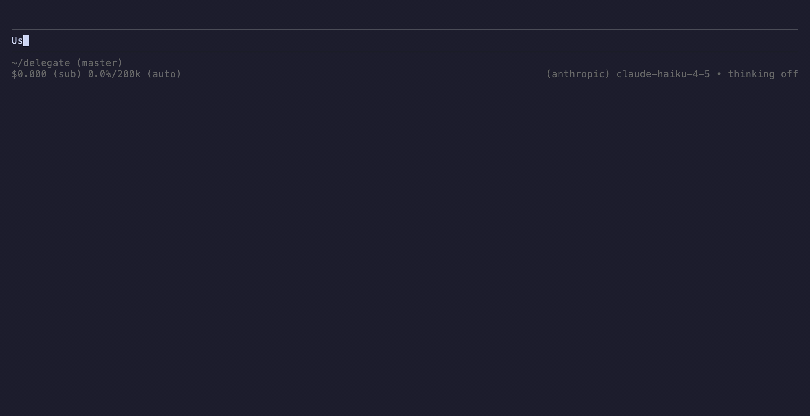

# `delegate`

`delegate` is a [Pi](https://github.com/earendil-works/pi) extension that adds support for subagents with isolated context windows.

Architecturally, `delegate` borrows heavily from Pi's [`subagent` extension example](https://github.com/earendil-works/pi/tree/main/packages/coding-agent/examples/extensions/subagent).
The crucial difference between these two extensions is that `delegate` leaves coordination (sequencing, branching, fan-out) to the agent, whereas the upstream extension exposes `chain` and `parallel` primitives.
This works because the agent can sequence tool calls across turns, and Pi executes tool calls from a single assistant message in parallel.



## Installation

```bash
pi install git:github.com/zuqq/delegate
```

For local development, clone `delegate` and reference it in `~/.pi/agent/settings.json`:

```json
{
	"packages": ["/absolute/path/to/delegate"]
}
```

## Defining agents

Agents are Markdown files in `.pi/agents/` (per project) or `~/.pi/agent/agents/` (per user). A `general-purpose` agent is built in.

For example, `.pi/agents/scout.md`:

```markdown
---
name: scout
description: locate code in this repository
tools: read, grep, find, ls
model: claude-haiku-4-5
---

The task names a symbol, feature, or concept. Search with `grep` and `find`, then read a few candidates to confirm.

Reply with file paths and line numbers, plus one line of context per hit.
```

`name` and `description` are required; `tools` and `model` are optional. See Pi's [`subagent` example agents](https://github.com/earendil-works/pi/tree/main/packages/coding-agent/examples/extensions/subagent/agents) for more.

## Development

```bash
npm install
npm run check
npm run lint:fix
npm run typecheck
npm test
```

## License

[MIT](./LICENSE)
